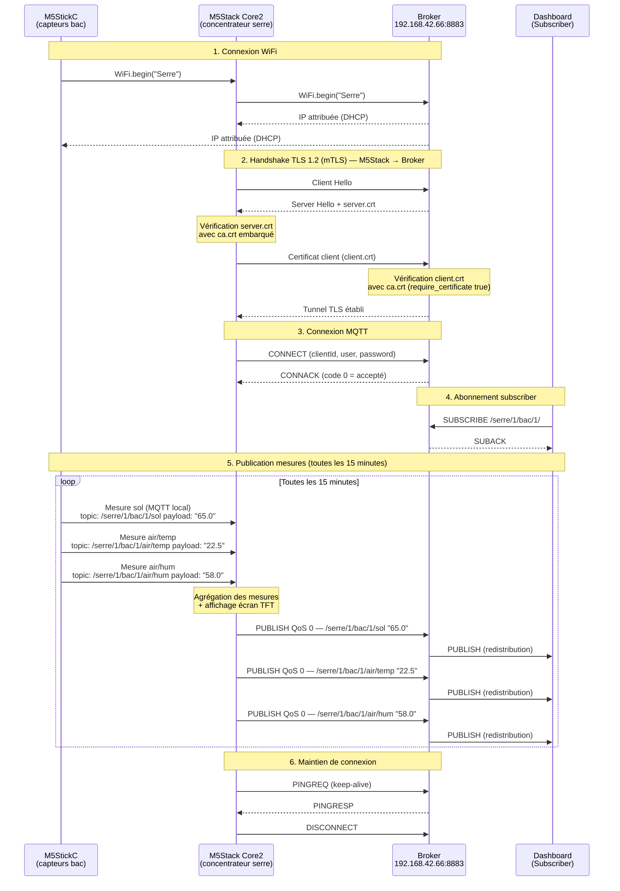

<h1>Bienvenue sur le GitHub du projet SIGACS<h1>
<h3>Par Alan BANCQUART, Titouan LE GOUALEC, Clément HERVOUET<h3>

  # 1. Présentation du protocole MQTT et de la sécurisation mTLS

Avant de détailler les échanges de notre système, il convient de définir le protocole utilisé. Le protocole **MQTT (Message Queuing Telemetry Transport)** est un standard de messagerie léger basé sur le principe de publication/abonnement (publish/subscribe). Très utilisé dans l'Internet des Objets (IoT), il permet à des capteurs (Publishers) d'envoyer des données à un serveur central appelé "Broker", qui se charge ensuite de les redistribuer aux clients abonnés (Subscribers), comme notre interface Web.

Dans l'architecture de notre projet, ce rôle de Broker est assuré par le service **Mosquitto**, hébergé sur une **machine virtuelle Ubuntu Server nommée `broker-server`**. Cette VM fait partie de l'infrastructure centralisée que j'ai déployée et configurée sur notre hyperviseur Proxmox.

Afin de répondre aux exigences de cybersécurité du projet, nous avons implémenté une couche de sécurité **mTLS (Mutual Transport Layer Security)**. Contrairement à une connexion TLS classique où seul le serveur prouve son identité, le mTLS exige que la carte M5Stack et le Broker Mosquitto d'Ubuntu Server s'authentifient mutuellement via des certificats cryptographiques. Cela garantit la confidentialité des données et empêche tout appareil non autorisé de publier sur notre réseau.
# Diagramme de séquence — Échanges MQTT sécurisés (mTLS)
**Projet SIGACS — BTS CIEL — Saint Joseph La Salle — Lorient — 2026**

## Légende

| Notation | Signification |
|---|---|
| `─►` Flèche pleine | Message envoyé |
| `- -►` Flèche pointillée | Réponse / accusé de réception |
| `Note` | Action interne (vérification, calcul) |
| `loop` | Séquence répétée toutes les 15 minutes |

## Description des échanges

**Phase 1 — Connexion WiFi :** le M5StickC et le M5Stack Core2 rejoignent tous deux le réseau "Serre" et obtiennent chacun une adresse IP par DHCP.

**Phase 2 — Handshake TLS 1.2 (mTLS) :** c'est le **M5Stack Core2** (concentrateur) qui établit le tunnel chiffré avec le broker. Il vérifie l'identité du broker grâce au certificat `server.crt` signé par la CA. Le broker vérifie à son tour l'identité du M5Stack grâce au certificat client `client.crt` (option `require_certificate true`). Aucune donnée ne transite en clair à partir de cette étape.

**Phase 3 — Connexion MQTT :** une fois le tunnel TLS établi, le M5Stack envoie un message `CONNECT` contenant son identifiant unique, son nom d'utilisateur et son mot de passe. Le broker répond `CONNACK` avec le code 0 (connexion acceptée).

**Phase 4 — Abonnement :** le Dashboard s'abonne au topic générique `/serre/1/bac/1/#` pour recevoir toutes les mesures du bac 1.

**Phase 5 — Publication :** toutes les 15 minutes, les M5StickC publient leurs mesures vers le **M5Stack Core2** via MQTT local. Le M5Stack agrège ces données, les affiche sur son écran TFT, puis les transmet au broker Mosquitto qui les redistribue au Dashboard.

**Phase 6 — Keep-alive :** le M5Stack envoie régulièrement un `PINGREQ` pour maintenir la connexion active avec le broker. En fin de session, il envoie `DISCONNECT` pour clôturer proprement la connexion.
Pour voir le répertoire dans sa globalité, voir le fichier [File-Tree.md].
